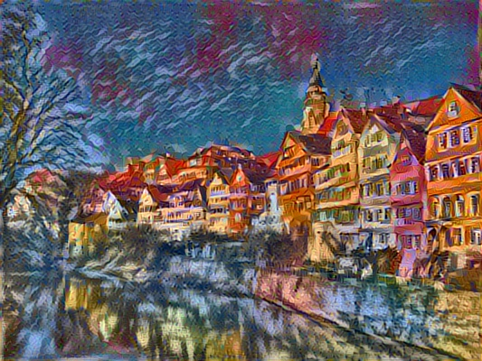
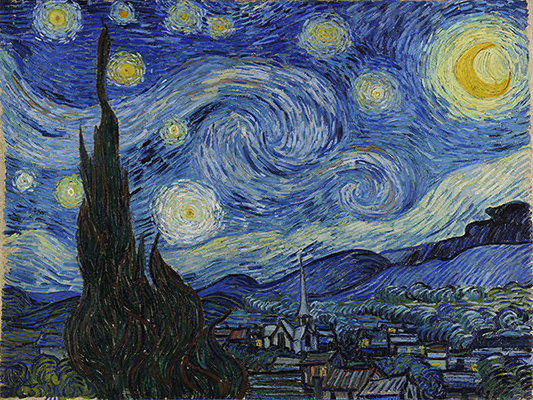

# Fast Style Combination

Thanks [neural_style][original-code] for the original code of [neural style][paper].

We modify the algorithms of [neural style][paper] to combine the styles of different images and speed up the orignal algorithm.

**See [here][lengstrom-fast-style-transfer] for an implementation of [fast
(feed-forward) neural style][fast-neural-style] in TensorFlow.**

## Running

`python neural_style.py --content <content file> --styles <style file> --output <output file>`

Run `python neural_style.py --help` to see a list of all options.

Use `--checkpoint-output` and `--checkpoint-iterations` to save checkpoint images.

Use `--iterations` to change the number of iterations (default 150).

## Example

Run `python neural_style.py --content <content file> --styles <style file> --output <output file>`

The content input image was a picture of the Stata Center at MIT:

The style input images were Picasso's "Dora Maar" and Starry Night, with the
Picasso image having a style blend weight of 0.8 and Starry Night having a
style blend weight of 0.2:

## Requirements

* [TensorFlow](https://www.tensorflow.org/versions/master/get_started/os_setup.html#download-and-setup)
* [NumPy](https://github.com/numpy/numpy/blob/master/INSTALL.rst.txt)
* [SciPy](https://github.com/scipy/scipy/blob/master/INSTALL.rst.txt)
* [Pillow](http://pillow.readthedocs.io/en/3.3.x/installation.html#installation)
* [Pre-trained VGG network][net] (MD5 `8ee3263992981a1d26e73b3ca028a123`) - put it in the top level of this repository, or specify its location using the `--network` option.

## License

Copyright (c) 2015-2017 Anish Athalye. Released under GPLv3. See
[LICENSE.txt][license] for details.

[net]: http://www.vlfeat.org/matconvnet/models/beta16/imagenet-vgg-verydeep-19.mat
[paper]: http://arxiv.org/pdf/1508.06576v2.pdf
[l-bfgs]: https://en.wikipedia.org/wiki/Limited-memory_BFGS
[adam]: http://arxiv.org/abs/1412.6980
[ad]: https://en.wikipedia.org/wiki/Automatic_differentiation
[lengstrom-fast-style-transfer]: https://github.com/lengstrom/fast-style-transfer
[fast-neural-style]: https://arxiv.org/pdf/1603.08155v1.pdf
[license]: LICENSE.txt
[original-code]: https://github.com/anishathalye/neural-style
